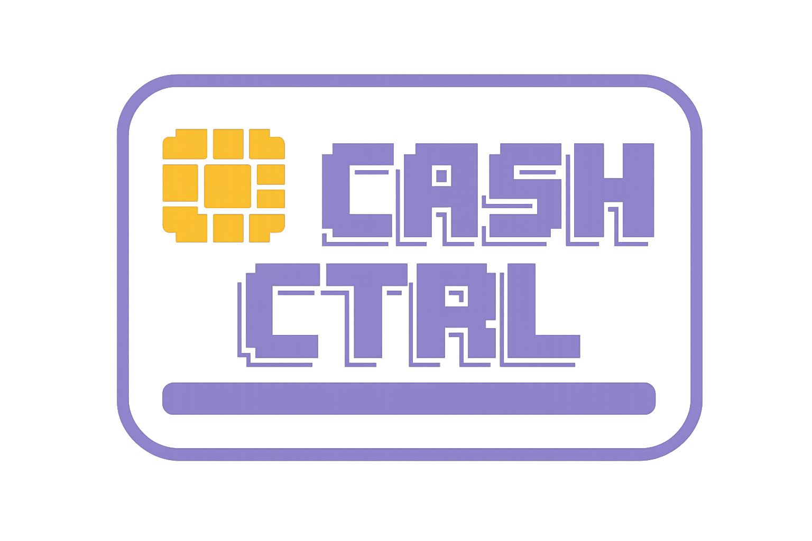

<h1 align="center">
  
  <br>
  CASH-CTRL
</h1>

<h3 align="center"> 
    Command-line finance control software
</h3>

---

## Overview

**Cash-Ctrl** is a minimalist TUI (Terminal User Interface) application for tracking personal expenses and income, stored as structured JSON files called *controls*.

Each control represents a financial period (e.g., "June 2026") and holds a starting balance, expenses, and incomes. The app runs fully in the terminal with a clean purple-on-black aesthetic.

---

## Installation

### Option 1 — TUI installer (recommended)

Download `cash-ctrl.exe` from the [release page](), place it anywhere, then run:

```powershell
.\cash-ctrl.exe --install
```

The TUI installer will:
1. Let you choose the install directory (default: `%LOCALAPPDATA%\CashCtrl`)
2. Copy `cash-ctrl.exe` to that directory.
3. Add the directory to your **user PATH** automatically.

Open a new terminal and you can use `cash-ctrl` from anywhere.

### Option 2 — Manual

1. Copy `dist/cash-ctrl.exe` to a folder of your choice (e.g. `C:\Tools`)
2. Add that folder to your user PATH:
   - Open **Start → Edit environment variables for your account**
   - Edit `Path` → add the folder

### Option 3 — Build from source

```powershell
# Requires .NET 10 SDK
# Run this command in the root folder from the repository
dotnet publish CashCtrl\CashCtrl.csproj -c Release -o dist
.\dist\cash-ctrl.exe --install
```

---

## Usage

```
cash-ctrl             Open the main welcome menu
cash-ctrl <name>      Open or create a control by name in the current directory
cash-ctrl .           Browse controls in the current directory
cash-ctrl --install   Run the TUI installer (add cash-ctrl to PATH)
cash-ctrl --help      Show this help message
cash-ctrl --version   Show the software version
cash-ctrl --update    Install update version
```

### Examples

```powershell
cash-ctrl              # opens main menu
cash-ctrl June-2026    # opens or creates Junho-2026.json in the current directory
cash-ctrl .            # browse in the current directory
```

---

## Dependencies

| Package | Version | Purpose |
|---|---|---|
| [.NET SDK](https://dotnet.microsoft.com/) | **10.0** | Runtime & build toolchain |
| [Spectre.Console](https://spectreconsole.net/) | **0.49.1** | TUI rendering: panels, figlet, tables, markup |

---

## Screens

### Welcome screen

Shows the `CASH-CTRL` figlet logo and a keyboard-navigable menu:
- **Open controls…** — select from recently opened or local controls
- **Create new control** — wizard to create a new `.json` control file

Navigation: `↑↓` select · `Enter` confirm · `Esc` quit

> Add image here

### Create new Control

Step-by-step form:
1. Control name (becomes the filename, e.g. `June-2026.json`)
2. Auto-preview of the save path
3. Starting balance (in BRL)

> Add image here

### Open Control

Preview panel showing the control name, total balance, and file path. Confirm with `Enter`, cancel with `Esc`.

> Add image here

### Main screen

Full-screen TUI with 3 columns at the top, a summary bar in the middle, and an entry list at the bottom.

**Top panels:**

- **Controls** — navigate between control files in the same directory
- **Expense types** — bar chart of spending by category
- **Calendar** — monthly calendar with colour-coded days (red = expense, green = income, purple = both)

**Middle bar:** Total Amount · Total Expenses · Available value · Clock

**Entry list:** Date · Name · Type · Amount · Origin — sortable, navigable, with detail view and delete mode

> Add image here

#### Main screen keyboard shortcuts

| Key | Action |
|---|---|
| `C` | Focus the controls panel |
| `I` | Edit the initial total balance |
| `T` | Add a new income |
| `E` | Add a new expense |
| `L` | Focus the entry list |
| `S` | Cycle calendar month (when entries span multiple months) |
| `↑` / `↓` | Navigate focused panel |
| `Enter` | Confirm / open detail |
| `D` | Enter delete mode (in list) |
| `Space` | Mark entry for deletion (in delete mode) |
| `Esc` | Cancel / exit focus / quit |
| F | Filter inside the list (use Tab to change columns |


### New Expense modal

- Fields: **Name · Amount · Type · Date** (Tab to cycle).
- Press `+` to add line items with quantity, unit (Kg / Un), and per-item price.
- Amount is calculated automatically for Kg items.

> Add images here

### New Income modal

- Fields: **Amount added · Date · Origin** (Tab to cycle)
- **Origin** is a tittle to explain from where the income comes.

> Add images here

### Edit Total Balance (`I`)

- Small modal to correct the initial `total-value` of the current period. Takes effect immediately.

> Add images here

### Expense Detail modal

- Read-only view of all line items for an expense entry (name, quantity, size, unit price, amount).

---

## Control file format

Controls are plain `.json` files stored wherever you create them.

- It's simple to verify and easier to store.

```json
{
  "June 2026": {               
    "total-value": 500.00,     
    "Fruit Srop": {            
      "date": "01/06/2026",      
      "total": 25.00,          
      "type": "market",           
      "type-color": "#FF6B6B",    
      "description": "Bought fruits",
      "origin": "expense",       
      "details": [             
        {
          "name": "banana",
          "amount": 10.00,
          "item-price": 5.00,
          "quantity": 2,
          "size": "Kg"
        }
      ]
    },
    "Salary": {
      "date": "05/06/2026",
      "total": 5000.00,
      "description": "August Salary",
      "origin": "income",
      "details": []
    }
  }
}
```

| Field | Description |
|---|---|
| `total-value` | Starting balance for the period |
| `origin` | `"expense"` (money out) or `"income"` (money in) |
| `type` / `type-color` | Expense category and its chart color |
| `description` | Display name shown in the entry list |
| `details` | Line items (optional). Each item has `name`, `amount`, `quantity`, `size` (`Kg`/`Un`), and optionally `item-price` |

Favorites and recents are stored in: `%APPDATA%\CashCtrl\favorites.json`

---

## Project structure (If it wants to understand the project)

```
Cash-Ctrl/
├── CashCtrl.slnx
├── CashCtrl/
│   ├── CashCtrl.csproj
│   ├── Program.cs                    ← CLI entry point & argument routing
│   ├── Theme.cs                      ← Color palette
│   ├── Fonts/
│   │   └── ansi-shadow.flf           ← Embedded figlet font
│   ├── Models/
│   │   ├── ControlFile.cs            ← Root data model
│   │   └── ControlEntry.cs           ← Expense / income entry + line items
│   ├── Services/
│   │   └── ControlService.cs         ← JSON I/O, favorites, period helpers
│   └── Screens/
│       ├── WelcomeScreen.cs          ← Splash + main menu
│       ├── CreateControlScreen.cs    ← New control wizard
│       ├── OpenControlScreen.cs      ← Open existing control
│       ├── MainScreen.cs             ← Full-screen finance dashboard
│       ├── NewExpenseModal.cs        ← Add expense with line items
│       ├── NewIncomeModal.cs         ← Add income
│       ├── EditTotalModal.cs         ← Edit initial balance
│       ├── ExpenseDetailModal.cs     ← View expense line items
│       └── InstallerScreen.cs        ← TUI installer (PATH setup)
├── dist/
│   └── cash-ctrl.exe                 ← Self-contained Windows executable
└── Docs/
    └── Details/
        └── Intro.md
```


